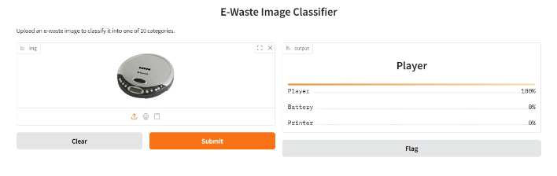

# 🧠 E-Waste Generation Classification using EfficientNetV2B0

This project uses **EfficientNetV2B0** with data augmentation to classify e-waste images into 10 categories, aiding sustainable waste management.

## 📁 Dataset

* Provided by mentor (originally sourced from Kaggle)
* Contains images of: Battery, Mobile, PCB, Printer, etc.
* `dataset.zip` is included for easy access.

## 📊 Features

* Transfer learning with EfficientNetV2B0
* Validation split, dropout, early stopping
* Achieved **97% accuracy** on test data
* Real-time prediction interface with **Gradio**

## 🧪 Output Samples

### 📊 Training Accuracy & Loss


### 📉 Confusion Matrix


### 🧪 Sample Predictions


### 🌐 Gradio Interface



## 🔮 Future Scope

* Multi-label classification (e.g., hybrid devices)
* On-device lightweight model
* Recycle center integration

## 🚀 Running the Model

```python
from tensorflow.keras.models import load_model
model = load_model('Efficient_classify_final.keras')
```
